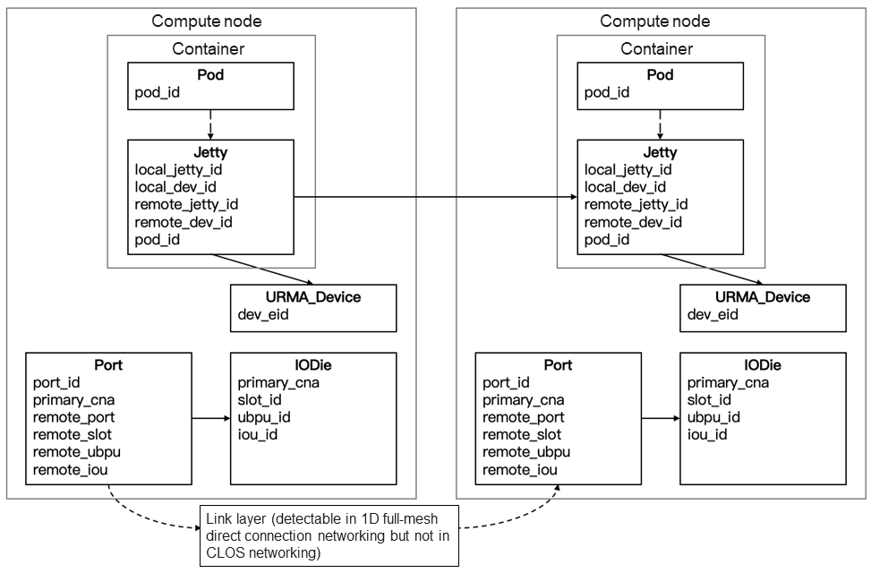

# witty-ub

UnifiedBus (UB) is an interconnection technology and architecture designed for computing systems. In the UB system leveraging the unified interconnection technology, all processing units are equivalent, and all resources can be pooled and shared. This implements flexible resource combination and efficient collaborative computing.

However, while providing an efficient resource collaboration mechanism, the UB architecture poses new challenges to O&M and fault diagnosis as follows:

* In a UB SuperPoD, a resource fault on a single node may spread to other nodes through dependencies such as sharing or borrowing. However, currently, each component and node only stores a fragment of local system resource information, which cannot support cross-node fault diagnosis.
* UB SuperPoD faults generate cross-component, multi-modal, and multi-source logs. These logs are correlated, making it difficult to identify which logs belong to the same fault event, thereby complicating the diagnosis process.
* The UB SuperPoD architecture leads to new complex fault patterns, for which current manual and intelligent fault diagnosis methods lack the necessary experience and knowledge, resulting in difficult fault diagnosis and low accuracy.

**witty-ub** provides fault information collection and intelligent diagnosis tools for UB SuperPoD availability faults. It supports both containerized and non-containerized service deployment modes.

* The topology collection tool **witty-ub-topo** collects cross-stack and cross-node resource topologies based on the query interfaces and log information provided by components on the management plane, control plane, and data plane. This tool is used to build the dependencies between key system resources, facilitating fault source inference during fault diagnosis.
* The log collection tool **witty-ub-log** collects logs of each component, identifies important fault events in the system, and associates logs of upstream and downstream components with fault events to provide more comprehensive and accurate fault event information.
* The fault diagnosis tool **witty-ub-diag** (coming soon) uses large models to diagnose faults based on fault information and domain knowledge.

The following link can help you use witty-ub:

* [Quick Start Guide to witty-ub](docs/quick-start.md) covers the entire process of compiling and using the witty-ub component.

## Feature Description

### Topology Collection (witty-ub-topo)

UB SuperPoD resources are dependent on each other. When a fault occurs on a resource, it will spread to other associated resources. Therefore, during fault diagnosis, a system resource topology needs to be constructed to reversely infer the fault source. Currently, **witty-ub-topo** supports topology collection for URMA communication scenarios. The types of resources to be collected and the collection methods are as follows:

* **Pod**: Containers deployed on the node. This type of resources is valid only when services are deployed in containerized mode and is collected using user command line input.
* **Jetty**: Communication Jetty resources created by URMA. This type of resources is collected from UMQ link setup logs.
* **URMA_Device**: URMA communication device resources. This type of resources is collected from UMQ link setup logs.
* **Port**: Communication ports. This type of resources is collected via the system topology query interface provided by UBM.
* **IODie**: I/O chips. This type of resources is collected via the system topology query interface provided by UBM.

The dependencies between resources and key fields are as follows:

For more details, see [User Guide](docs/quick-start.md#超节点系统拓扑实时感知工具witty-ub-topo使用指导).

### Log Collection (witty-ub-log)

Logs are an important source of information for SuperPoD faults. Collecting logs of each functional component of the UB SuperPoD and accurately identifying fault events and associated logs are important steps in fault diagnosis. Currently, **witty-ub-log** supports log collection, event identification, and log association for URMA communication. Component logs are filtered based on keywords. The following communication components support log collection:

* **UbSocket**: Used for UB communication ecosystem construction. It is compatible with the Socket programming interfaces and enables network communication performance improvement without TCP application modification.
* **UMQ**: A high-performance transmission component implemented based on the LD/ST semantics and shared memory.
* **URMA**: Implements unified memory semantics and provides remote memory access operations such as one-sided, two-sided, and atomic operations. Log collection is supported for the URMA user-mode component libURMA and kernel-mode component URMA core.
* **UDMA**: UB hardware driver, which provides the capability of sending and receiving data at the network layer. Log collection is supported for the UDMA user-mode component libUDMA and kernel-mode component UDMA core.

Three types of major faults can be identified: **link setup, link deletion, and data plane faults**. This is achieved by identifying non-debug and non-info logs printed by entry point functions related to UMQ component operations.

After a fault event is identified, the associated logs are further identified based on information in the time and resource dimensions.

* **Time dimension**: The printing time of the logs associated with the event must be close to the time when the event occurs. For the upstream component (UbSocket) of UMQ, the time range is set to within 10 seconds after the event occurs. For UMQ and its downstream components (libURMA, URMA core, libUDMA, and UDMA core), the time range is set to within 10 seconds before the event occurs.

* **Resource dimension**: The logs associated with the event must match the resources related to the event. For UMQ and libURMA logs, the resource types include the program and process names. For UMQ logs, the resource types also include the local and peer Jetty and URMA devices.

For more details, see [User Guide](docs/quick-start.md#超节点多源系统日志解析工具witty-ub-log使用指导).

## Roadmap

### Upcoming

* [ ] Intelligent fault diagnosis (new function): The witty-ub-diag tool is provided to perform intelligent fault diagnosis for the UB SuperPoD based on the large model.
* [ ] More intelligent log parsing: A cross-component function and log template tree can be built to implement function-level precise log association.
* [ ] More application scenarios: Fault information collection and intelligent diagnosis are supported in memory borrowing scenarios.

### Current Progress

* [x] witty-ub release
* [x] URMA communication fault scenarios
* [x] Fault collection for the UB SuperPoD
* [x] Log collection for the UB SuperPoD

## How to Contribute

We welcome new contributors to join the project and are very pleased to provide guidance and help for new contributors. You can contribute by submitting issues or merging PRs.

## Licensing

witty-ub uses Mulan PSL v2.
