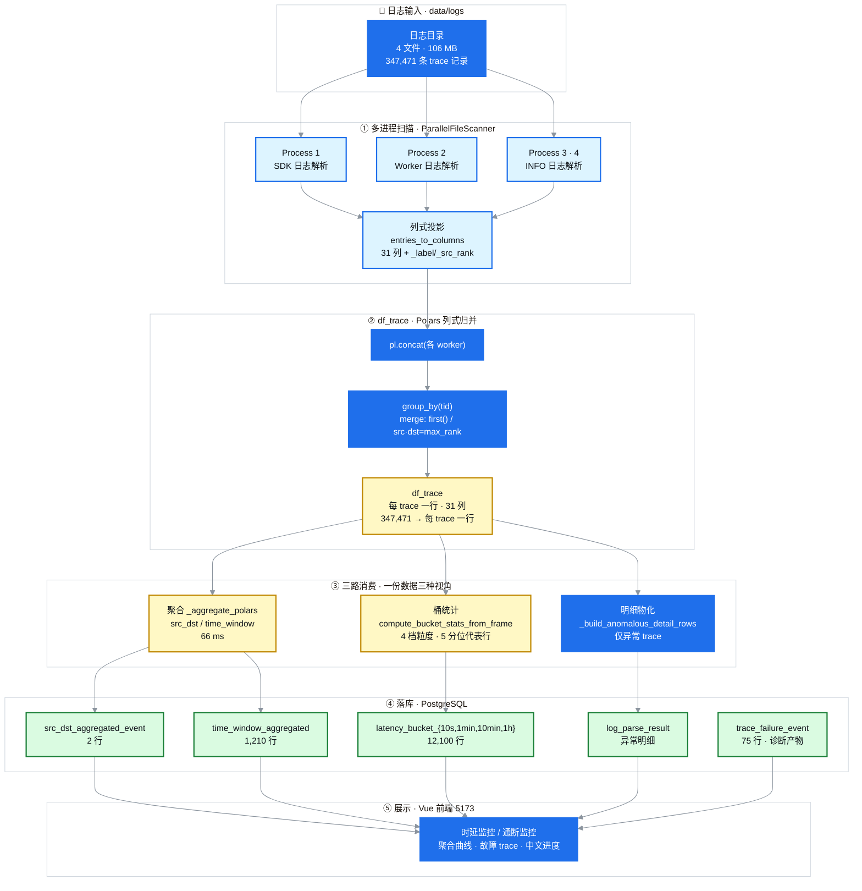

# Polars 管线重写 — 架构设计图

本次优化把 latency 插件的聚合管线从"平铺 dict + 串行 numpy + shared_memory
桶统计"重写为 **worker 直产 polars 列 → concat → polars 归并 → polars 聚合**,
用 polars 天然并行替代 numpy 单线程。

## 设计图

> PyCharm / VSCode / Typora 等本地编辑器直接显示上图;
> gitcode / GitHub 网页端渲染下方的 Mermaid 源码。

📐 Mermaid 源码(可编辑, gitcode/GitHub 网页端自动渲染)

> 可编辑源文件: [`polars-pipeline-architecture.mmd`](figures/polars-pipeline-architecture.mmd)
> (纯 Mermaid, 供编辑器 / mermaid-cli 使用) / [`polars-pipeline-architecture.svg`](figures/polars-pipeline-architecture.svg)

## 各层说明

| 层 | 组件 | 数据结构 | 关键点 |
|----|------|----------|--------|
| **① 扫描** | `ParallelFileScanner` (多进程) | `{label: [entries]}` → 列式 dict | 每 entry 一行, 31 列 TRACE_COLUMNS + 2 内部列(_label/_src_rank), 稀疏+None 对齐 |
| **② df_trace** | `build_trace_frame` (polars) | `pl.DataFrame` 每 trace 一行 | `group_by(tid)` + merge spec: `first()` 取首个非空, src/dst 按 max_rank(URMA>RemotePull) |
| **③ 三路消费** | `_aggregate_polars` / `compute_bucket_stats_from_frame` / `_build_anomalous_detail_rows` | 3 类 dataclass + 代表行 | **一份 df_trace, 三种视角**; 聚合 66ms / 桶统计 4 档 / 明细仅异常 |
| **④ 落库** | PostgreSQL | 5 类表 | src_dst / time_window / latency_bucket_{4档} / log_parse_result / 诊断表 |
| **⑤ 展示** | Vue 前端 | JSON → ECharts | 聚合曲线 + 故障 trace + 中文进度 |

## 性能对比(347,471 traces)

| 阶段 | 旧 numpy | Polars |
|------|---------|--------|
| 聚合 | 131.9s | **66ms** (~2000x) |
| 总解析 | ~155s | **8s** |

## 设计原则

1. **列式贯穿**: 从 L1 列式 → L2 df_trace 全程 polars, 无 dict 中间层
2. **一份数据三种消费**: 聚合/桶统计/明细共用 df_trace, 字段一致性有 golden 保证
3. **mergr spec 可配**: `_MERGE_SPEC` 集中管理归并规则, 改一处即可调整
4. **冻结契约**: TRACE_COLUMNS 是 31 列冻结契约, parity 测试逐字段验证
