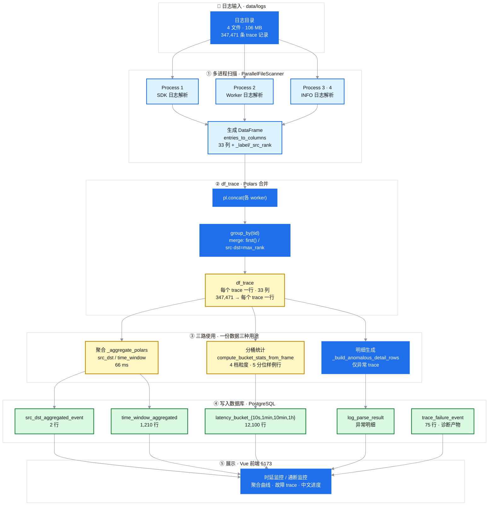

# Polars 管线重写设计说明书

## 1. 背景与问题

latency 日志解析的聚合管线在重写前依赖「扁平字典 + 串行 numpy + shared_memory 分桶统计」：扫描进程把日志按 label 分桶成 `{label: [条目]}`，主进程再把它拼成「每个 trace 一个扁平字典」，随后用 numpy 单线程逐字段算聚合，分桶统计还要靠 shared_memory 在进程间搬运数组。

主要问题：

- **numpy 单线程**：CPU 利用率低，聚合 131.9s，总解析约 155s；
- **shared_memory 进程间传数组**：切片、搬运、同步开销大；
- **数据被多份重复组织**：聚合、分桶统计、明细各自遍历，代码路径分散，字段一致性难以保证。

## 2. 目标与非目标

**目标**

1. 用 polars 的列式计算与内置多线程并行，替代 numpy 单线程；
2. 扫描进程直接产出**列式数据**（每行一条日志），去掉 `{label: [条目]}` 中间层；
3. 生成一份「每个 trace 一行」的 DataFrame（df_trace），供聚合、分桶统计、明细三路复用；
4. 与旧实现**逐字段一致**（golden parity 保证），表的字段与结构不变。

**非目标**

- 不改变对外数据结构与 API（表结构、字段、接口保持不变）；
- 不引入新的外部依赖（polars 本身已在依赖中）；
- 不做跨节点分布式（仍是「单机多进程扫描 + polars 并行」）。

## 3. 现状分析

改造前的处理链（已由本轮替换）：

1. `ParallelFileScanner` 多进程扫描日志，按 label 分桶成 `{label: [条目]}`；
2. 主进程把每个 trace 的条目按 label 顺序拼成扁平字典（`_build_flat_trace_index`）；
3. `_resolve_snapshot` / `_extract_trace_metrics` 用字典逐字段解析延迟；
4. 聚合用 numpy 单线程；分桶统计用 `_filter_and_build_arrays` + shared_memory `_parallel_pick`（`multiprocessing.spawn`）跨进程挑选分位样例行；
5. 明细与聚合各自完整遍历一遍。

## 4. 总体设计

新管线把「分桶输出 → 主进程拼字典 → numpy 聚合」重写为「扫描进程生成列 → 合并 → 生成 df_trace → polars 三路使用」：

```
日志输入
  → ① 多进程扫描（生成列，每行一条日志）
  → ② 生成 df_trace（每个 trace 一行）
  → ③ 三路使用（聚合 / 分桶统计 / 明细）
  → ④ 写入数据库（PostgreSQL）
  → ⑤ 前端展示（Vue）
```


> PyCharm / VSCode / Typora 等本地编辑器直接显示上图；gitcode / GitHub 网页端渲染下方的 Mermaid 源码。

<details>
<summary>📐 Mermaid 源码（可编辑，gitcode / GitHub 网页端自动渲染）</summary>



</details>

> 可编辑源文件：[`polars-pipeline-architecture.mmd`](../figures/polars-pipeline-architecture.mmd)（纯 Mermaid，供编辑器 / mermaid-cli 使用）/ [`polars-pipeline-architecture.svg`](../figures/polars-pipeline-architecture.svg)

## 5. 数据模型

### 5.1 扫描 worker 的列式输出（T1）

每条日志条目被投影成一行，列 = **TRACE_COLUMNS（33 列）** + 2 个内部列（`_label` / `_src_rank`）+ 5 个用于分段时延的内部列（`_elapsed_us` / `_resp_msg` / `_rpc_e2e_us` / `_rpc_server_exec_us` / `_rpc_network_us`）。

按「稀疏 + 空值补齐」组织：每个 label 只填充自己声明的列，其余列填空值；行序 = label 顺序 + label 内条目顺序，保证后续归并取「首个非空」的语义与旧实现一致。

**TRACE_COLUMNS 33 列（冻结约定，与旧的扁平字典逐键对齐）**：

`tid`, `total_ms`, `total_latency`, `src`, `dst`, `op`, `operation`, `op_key`, `bucket_epoch`, `log_id`, `status_code`, `timestamp`, `pod_ip`, `cluster_name`, `host`, `data_size`, `inflight_count`, `c2w_urma_latency`, `urma_total_latency`, `urma_link_latency`, `worker_query_meta_latency`, `worker_total_latency`, `sdk_process`, `sdk_rpc`, `local_worker_cost`, `local_worker_lock`, `remote_worker_cost`, `remote_worker_rpc`, `master_process`, `master_rpc_total`, `w2w_urma_latency`, `create_latency`, `publish_latency`

### 5.2 df_trace（T2）

把各个 worker 的列式输出 `pl.concat`（纵向拼接）后 `group_by("tid")` 归并，得到**每个 trace 一行**、列 = TRACE_COLUMNS 的 DataFrame。

归并规则（`_MERGE_SPEC`，逐列可配）：

| 规则 | 作用 |
| --- | --- |
| `first()`（默认） | 取该列首个非空行，复现扁平字典 `entries[0]` 的语义 |
| `max_rank`（`src` / `dst`） | 按 `_src_rank` 最高优先取该 trace 的来源/目的地址（URMA=2 > RemotePull=1 > 其他 0） |
| `implode_unique`（`pod_ip` / `cluster_name`） | 收集该 trace 涉及的所有 pod 与集群 |

归并后推导 `c2w_urma_latency`（= `total_ms - worker_total_latency`），并内置计算 yuanrong 26 项分段时延。

### 5.3 写入的表

| 表 | 用途 |
| --- | --- |
| `src_dst_aggregated_event` | 按（源、目的、操作）聚合：总量、异常量 |
| `time_window_aggregated` | 按（时间桶、源、目的、操作）聚合：总量、异常量、平均/最小/最大/P95/P99 时延 |
| `latency_bucket_{10s,1min,10min,1h}` | 四档粒度的分位样例行，共 48 列（8 固定键 + 14 时延指标 + 26 分段时延） |
| `log_parse_result` | 仅异常 trace 的明细行 |
| `trace_failure_event` | 通断故障诊断产物 |

## 6. 详细设计

### 6.1 扫描与生成列（T1）——`entries_to_columns`

`{label: [条目]}` → `{列名: [值]}`。每条条目填一行：该 label 声明的列填投影值，其余 TRACE_COLUMNS 列填空值；同时打上 `_label` / `_src_rank` 及分段时延内部列。`columns_to_frame` 再把列式字典转成 polars DataFrame。

### 6.2 生成 df_trace（T2）——`build_trace_frame`

`pl.concat` 拼接各 worker 的列式输出 → `group_by("tid")` 按 `_MERGE_SPEC` 归并 → 推导 `c2w` → 过滤无 SDK / 负时延 / 空 tid 的 trace → `src`/`dst` 空串兜底。

### 6.3 聚合（T3）——`_aggregate_polars`

单次 `group_by`，无需 spawn / pickle / 分片：

- 先算异常集：`total_ms >= threshold` 的 trace；
- `src_dst`：`group_by(["src","dst","op_key"])`，统计总量与异常量（`is_anomalous.sum()`）；
- `time_window`：`group_by(["bucket_str","src","dst","op_key"])`，额外算平均/最小/最大/P95/P99；`bucket_str` 由 10s 对齐的 `bucket_epoch` 格式化为 `YYYY-MM-DD HH:MM:SS`；
- `p99` 用 `quantile(0.99, interpolation="linear")`，对齐旧 numpy `np.percentile`（默认 linear）语义。

### 6.4 分桶统计（T4）——`compute_bucket_stats_from_frame`

纯 polars 选择分位样例行（替代共享内存 pick）：

- 过滤：`bucket_epoch` 与 `total_ms` 非空的行；
- 组键：`(桶号, 操作)`，桶号 = `bucket_epoch // 粒度`，操作用 GET/SET 编码；
- 代表行：组内按 `total_latency` 排序（`rank("ordinal")`，并列按行序稳定断开）后取 4 个分位（均值/ P99 / P9999 / 最大）对应的行；
- yuanrong 富化：对四档粒度选中的 trace 去重后一次算出 26 项分段时延，再按 tid 并回代表行（不重复计算）；
- 四张表 `DELETE + INSERT` 放在同一个事务里（写库幂等）。

### 6.5 明细生成（T5）——`_build_anomalous_detail_rows`

按 `tid ∈ 异常集` 过滤 `df_trace`，逐行物化成 `LogParseResult` 明细行（仅异常 trace），写入 `log_parse_result`。

### 6.6 写入数据库（T4/T5）——`store_result`

`log_parse_result` / `src_dst_aggregated_event` / `time_window_aggregated` 三表各自 `asyncio.gather` 并行写（无表间依赖）；四张分桶表由单独的降级路径写。单表失败只记日志，不阻塞其他表。

## 7. 关键设计决策与权衡

1. **一份 df_trace 三路复用**：聚合、分桶统计、明细共用同一 DataFrame，字段一致性由 golden 保证，减少重复遍历与字典中间层。
2. **归并规则可配置**：`_MERGE_SPEC` 集中管理，想改某列策略只改一处映射。
3. **polars 并行替代 numpy 单线程**：聚合与分桶统计耗时大幅下降。
4. **聚合 P99 用线性插值**：polars 默认 `nearest` 会有约 1% 偏差，改为 `linear` 对齐旧实现。
5. **分桶用绝对墙钟对齐**：桶号 = 墙钟 epoch 秒 // 粒度（floor），跨天与 DST 日不碰撞，桶起点可由桶号直接还原，与回退实时 SQL 的 `date_trunc` 表达一致。
6. **分位取行用 `rank("ordinal")` + kth 位置**：与旧 numpy `argpartition` 的分位位置语义一致（`floor(cnt*p)-1`，clamp 到 `[0,cnt-1]`）。

## 8. 性能数据（347,471 条 trace）

| 阶段 | 旧 numpy | Polars |
| --- | --- | --- |
| 聚合 | 131.9s | **66ms**（约 2000 倍） |
| 总解析 | 约 155s | **8s** |

## 9. 正确性与兼容性

- `TRACE_COLUMNS` 是**冻结约定**：必须等于旧扁平字典的全部键（聚合标量 + 全部时延 + 明细字段），逐列对齐才能保证下游与 golden fixture 字段级一致；
- 列名与扁平字典键名一致，`df_trace` 无需做列名映射；
- golden fixture 捕获自旧参考实现，polars 路径与之一致并由 parity 测试逐字段验证。

## 10. 测试策略

- `test_trace_frame` / `test_polars_pipeline_parity`：df_trace 与聚合结果的逐字段 parity；
- `test_merge_regression_local_features`：归并规则回归；
- `test_columnar`：逐列生成正确性；
- `test_bucket_statistics`：分位样例行与旧 numpy 语义一致；
- `test_integration_pipeline` / `run_e2e_log_parse`：端到端解析链路；
- `test/golden/capture_golden`：golden fixture 采集。

## 11. 实施范围与状态

列式扫描、生成 df_trace、polars 聚合、polars 分桶统计、明细生成、写库各环节（T1–T7）均已落地并保留回归测试；旧 numpy / shared_memory / `multiprocessing.spawn` 实现已删除。

## 12. 验证清单 / 下一步

- [ ] 字段级 parity：`test_polars_pipeline_parity` 全绿；
- [ ] 三种部署形态（Docker / RPM / 源码）解析链路回归一致；
- [ ] 聚合与分桶统计性能达到预期（聚合 ≤ 百毫秒量级）；
- [ ] 前端展示：时延/通断聚合曲线、异常 trace、分桶统计图正常。
