# 超节点故障智能监控诊断平台操作指南

## 简介

witty-ub 超节点故障智能监控诊断平台是基于故障树驱动的诊断引擎，对 KVCache 和 URMA 组件日志进行多级故障定界分析，自动识别超节点系统中的连接故障，并提供可视化故障监控和智能诊断分析报告。

该工具采用 client-server 架构，支持在超节点系统中部署服务，并通过 Web 前端进行交互式操作和可视化展示。

---

## 核心功能模块

### 1. 资产库管理

该平台支持对超节点系统中的日志解析任务建立资产库。

**资产库是日志解析任务的基础隔离单元，不同类型或不同业务场景的日志建议分别创建资产库进行管理。每个资产库拥有独立的解析配置、任务记录和异常结果，互不影响。**

该模块支持以下功能：

- **新建资产库**：点击"资产管理"右侧的"添加资产库"按钮，填写资产库名称和描述，即可新建资产库
- **查找资产库**：点击"资产管理"右侧的"查询资产库"按钮，支持按资产库名称、描述、创建时间等条件进行查询，方便快速定位目标资产库
- **编辑资产库**：在"资产库详情"页面点击"编辑"按钮，可修改资产库的名称和描述信息
- **删除资产库**：在"资产库详情"页面点击"删除"按钮，可删除该资产库及其下的所有日志解析任务和异常结果，**删除操作不可恢复，请谨慎操作**
- **资产库日志解析配置**：在"资产库详情"页面点击"修改配置"按钮，可配置该资产库下的日志解析任务的解析规则，包括日志文件名 pattern 和日志分析参数进行配置，支持一键导入其他资产库的配置和恢复默认配置
  - **日志文件名 Pattern**：支持 glob 风格的文件名匹配模式，可设置 SDK 客户端接口|运行日志、Worker 接口|运行日志和资源日志的匹配模式
  - **日志分析参数**：
    - **时延阈值**：各指标的 P99 异常阈值，可设置总时延、C2W 时延、W2W 时延、URMA 建链时延和查询元数据时延的 P99 阈值
    - **滑动窗口参数**：各指标滑动窗口检测的参数，支持设置各窗口大小和步长，以及新增和删除窗口
    - **区间异常密度阈值**：窗口被判定为异常的密度阈值
- **添加日志解析任务**：在输入框中输入后端服务所在服务器上的日志路径，或上传本地打包好的日志 ZIP 文件，即可创建日志解析任务，解析完成后会显示当前任务的时延异常数和通断异常数。支持上传的路径类型如下：
  - **服务器路径**：后端服务所在服务器上的日志路径，支持目录和压缩包（*.tar.gz、*.gz、*.zip）
  - **远程 URL**：支持 HTTP/HTTPS 协议的远程 URL

### 2. 时延故障监控

支持对超节点系统中的时延异常进行监控和分析，提供关键时延指标趋势图、聚合事件列表和异常 Trace 列表，帮助用户快速定位时延异常的根因。

- **关键时延指标趋势图**：可选择想查看的指标曲线，支持按时间段展开和切换百分位指标
- **聚合事件列表**：分时间段按"源 IP->目标 IP"聚合时延异常事件，支持查看聚合事件详情和关联日志，支持切换时间段步长大小
- **异常 Trace 列表**：列出所有时延异常 Trace，支持查看异常 Trace 关联日志

### 3. 通断故障监控

支持对超节点系统中的通断异常进行监控和分析，提供故障码计数时序分布图、聚合事件列表和异常 Trace 列表，帮助用户快速定位通断异常的根因。

- **故障码计数时序分布图**：展示不同故障码的计数随时间的变化趋势，支持按时间段展开和切换展示的故障码
- **聚合事件列表**：分时间段按"Pod IP/name"聚合通断异常事件，支持查看聚合事件详情和关联日志，支持切换时间段步长大小
- **异常 Trace 列表**：列出所有通断异常 Trace，支持查看异常 Trace 关联日志
- **关联日志可查看命中的故障模式**

---

## 操作流程

### 步骤 1：进入默认页面

### 步骤 2：添加资产库

点击"资产管理"右侧的加号 ，填写资产库名称和描述。

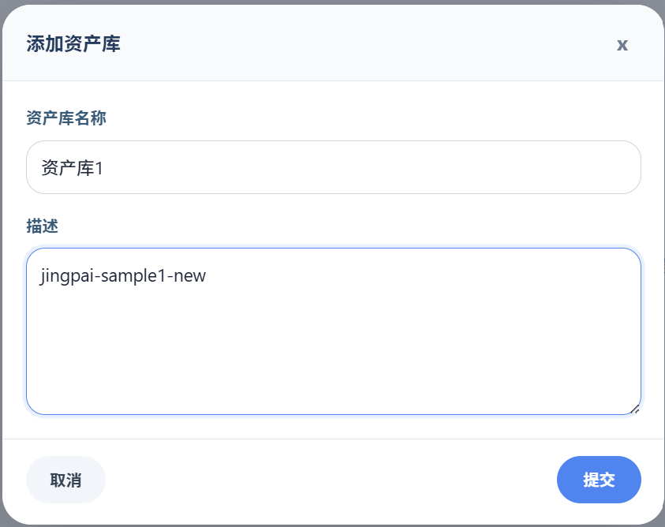

### 步骤 3：日志解析配置

点击新建的资产库进入资产库详情页，点击"修改配置"按钮，配置该资产库下的日志解析任务的解析规则。

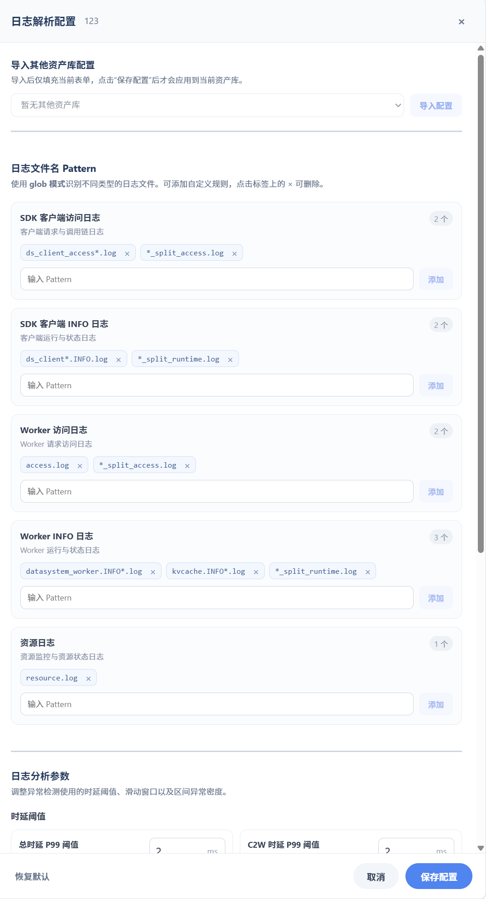

### 步骤 4：新建日志解析任务

输入后端服务所在服务器上的日志路径，点击"添加"，或点击"上传 ZIP 文件"上传本地打包好的日志，会自动创建解析任务，并在任务列表中显示。解析完成后，会显示当前任务的时延异常数和通断异常数。

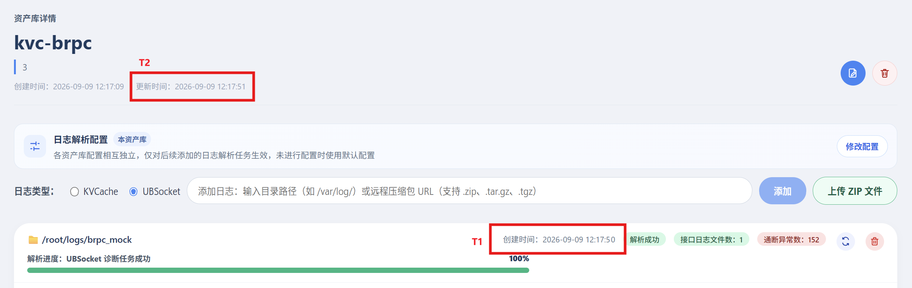

### 步骤 5：时延监控

点击"章节导航"中的"时延故障监控"，进入时延监控页，会加载关键时延指标趋势图、聚合事件列表和异常 Trace 列表。

#### 5.1 关键时延指标趋势图

可选择想查看的指标曲线。

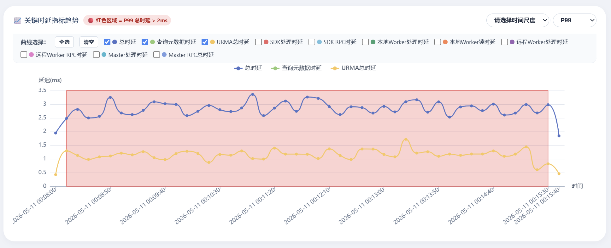

- 在"曲线选择"中可选择想查看的时延指标曲线
- **按时间段展开**：右上角选择时间尺度，再点击图中的时间点，展开该时间段内的关键时延指标趋势图；按时间段展开后点击"重置"可恢复到默认设置
- **切换百分位指标**：右上角选择 P99 或 P9999，即可切换关键时延指标趋势图的百分位指标

#### 5.2 聚合事件列表

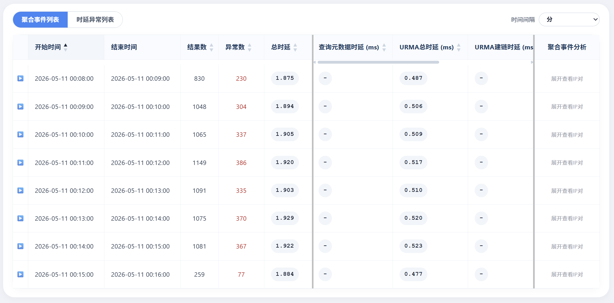

- **时间段内聚合事件**：点击一个条目，展开该时间段内的按"源 IP->目标 IP"的聚合事件列表

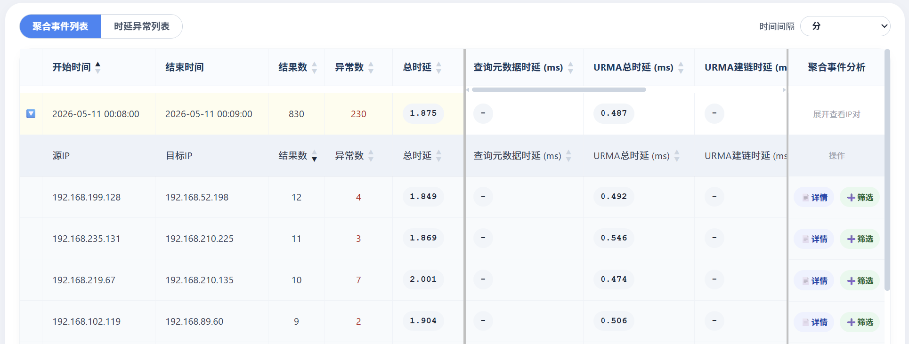

- **聚合事件详情**：点击右侧"详情"按钮，查看该聚合事件的详情，包括该聚合事件的关键时延指标趋势图和时延异常列表

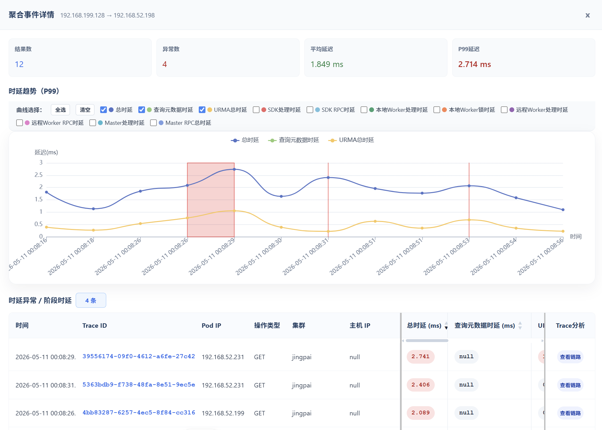

- **时延异常 Trace 关联日志**：点击"查看链路"按钮，查看该时延异常 Trace 关联的日志

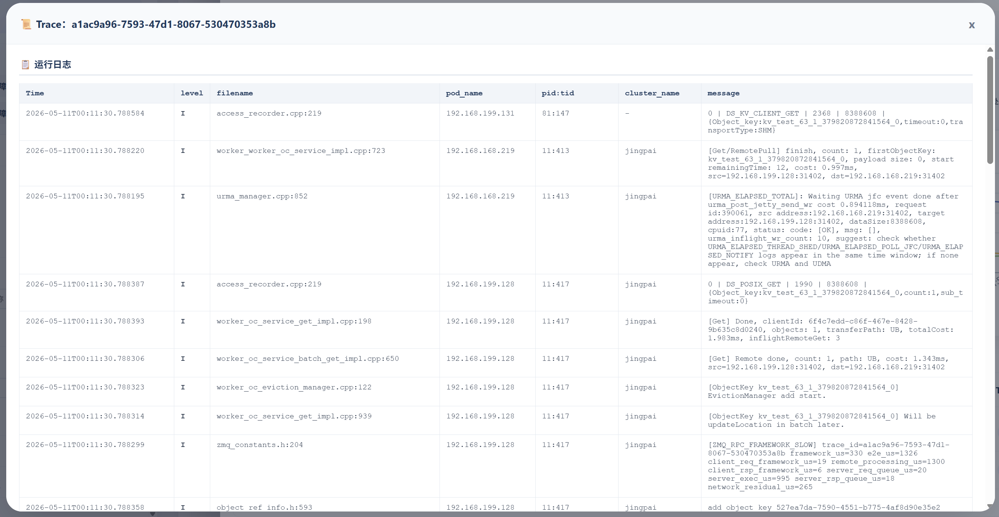

#### 5.3 异常 Trace 列表

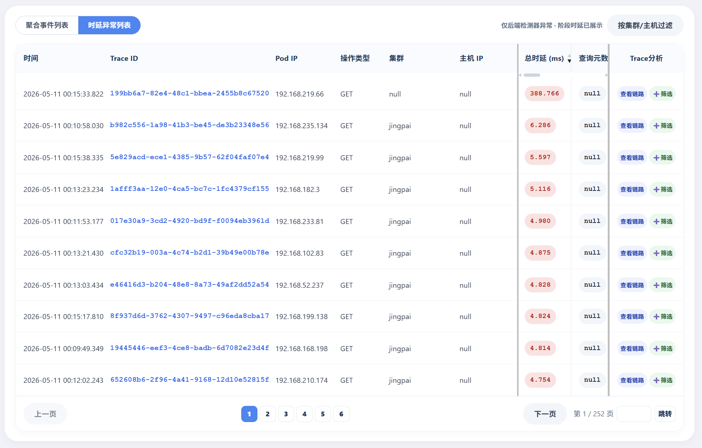

- **时延异常 Trace 关联日志**：点击右侧"查看链路"按钮，查看该时延异常 Trace 关联的日志，与聚合事件详情的"查看链路"一致

### 步骤 6：通断监控

点击"章节导航"中的"通断故障监控"，进入通断监控页，会加载故障码计数时序分布图、聚合事件列表和异常 Trace 列表。

#### 6.1 故障码计数时序分布图

可选择想查看的故障码计数曲线。

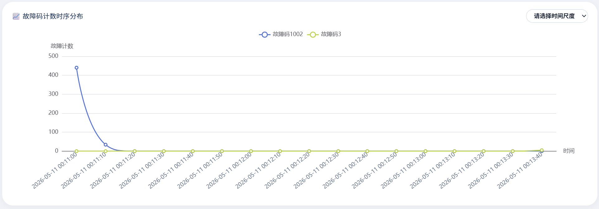

- **按时间段展开**：右上角选择时间尺度，再点击图中的时间点，展开该时间段内的故障码计数时序分布图

#### 6.2 聚合事件列表

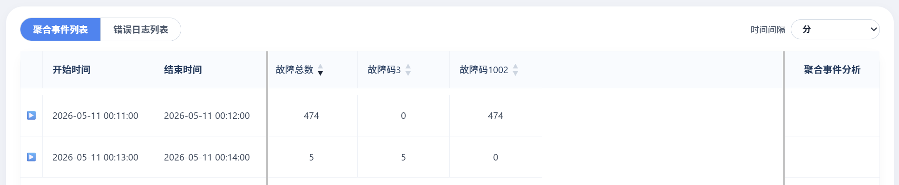

- **时间段内聚合事件**：点击一个条目，展开该时间段内的按"Pod IP"的聚合事件列表

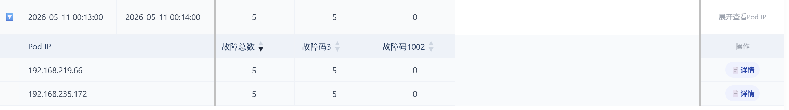

- **聚合事件详情**：点击右侧"详情"按钮，查看该聚合事件的详情，包括该聚合事件的故障码计数时序分布图和错误日志列表

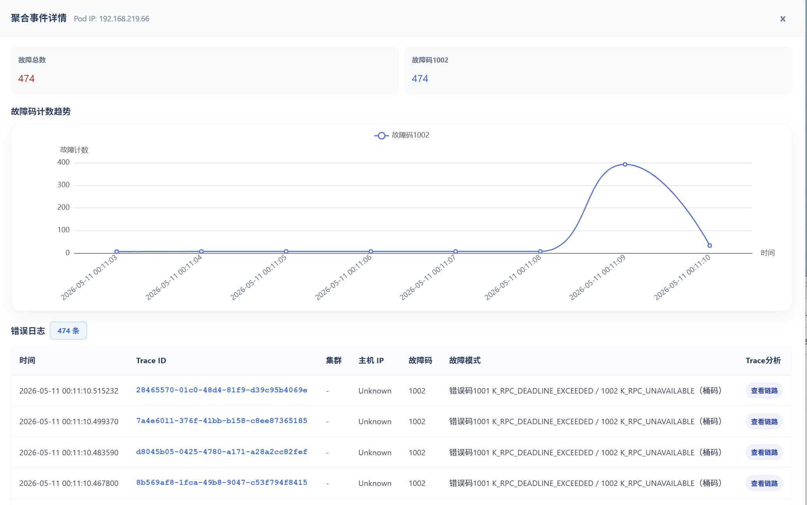

- **通断异常 Trace 关联日志**：点击"查看链路"按钮，查看该通断异常 Trace 关联的日志，命中故障模式或 level 为 ERROR 的日志会被标记为红色，level 为 WARNING 的日志会被标记为黄色；可点击故障模式标签，查看该故障模式的详细信息

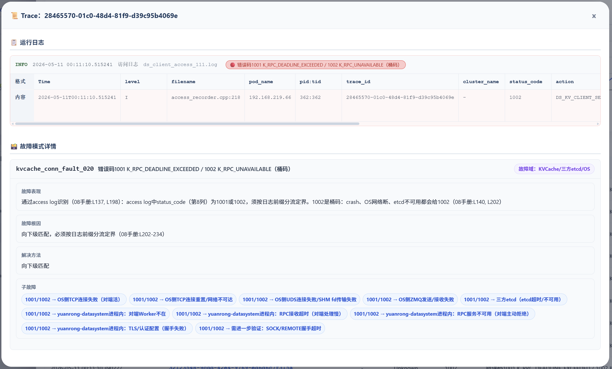

#### 6.3 异常 Trace 列表

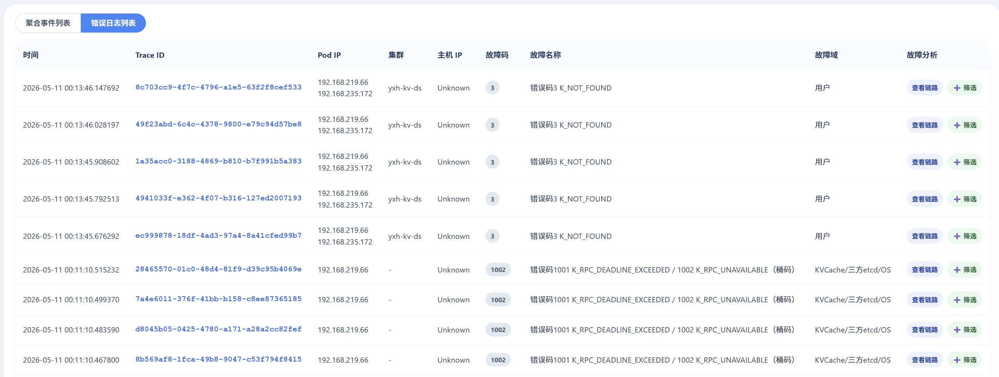

- **通断异常 Trace 关联日志**：点击右侧"查看链路"按钮，查看该通断异常 Trace 关联的日志，与聚合事件详情的"查看链路"一致

### 步骤 7：条件筛选

#### 7.1 多条件筛选

可对时间、集群、主机、Pod、源 IP、目标 IP 等条件进行单值筛选，添加新条件值会覆盖已存在的条件值，支持多条件组合筛选。

- 通过日历组件选择开始时间和结束时间
- 通过输入筛选条件的具体值，点击"添加"缓存到筛选条件
- 点击"确认筛选"将筛选条件应用到当前页面，刷新页面数据，包括关键时延指标趋势图、时延聚合事件列表、时延异常 Trace 列表、故障码计数时序分布图、通断聚合事件列表和通断异常 Trace 列表
- 点击各项目的"重置"能清空该项目的条件值，点击"重置全部"能清空所有筛选条件，需再次点击"确认筛选"应用新的筛选条件

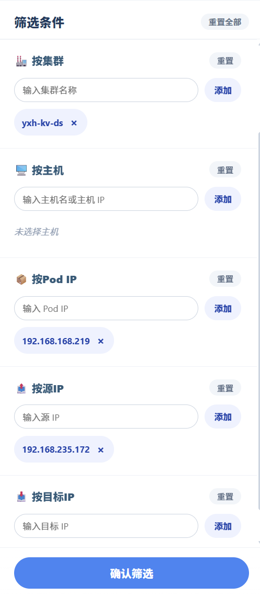

#### 7.2 按集群/主机过滤

点击异常 Trace 列表右上角的"按集群/主机过滤"按钮，选择想要过滤的集群或主机添加到筛选条件，在导航栏"筛选条件"中点击"确认筛选"即可查看指定集群/主机的异常 Trace 条目。

### 步骤 8：Agent 诊断智能体

#### 8.1 登录

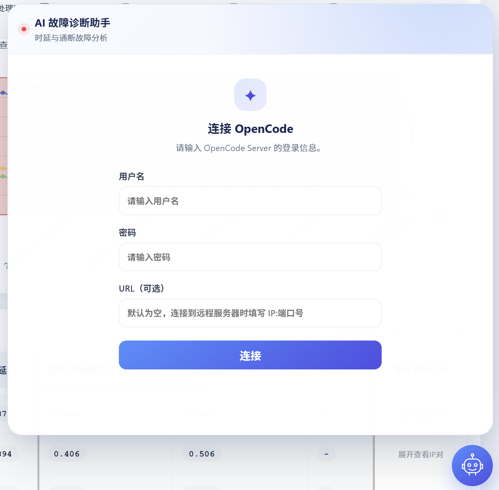

- 在监控页点击右下角的机器人图标，打开 Agent 智能体对话框
  - **本地连接**：直接点击"连接到本机 OpenCode 服务器"，无需输入用户名和密码
  - **远程连接**：输入 OpenCode Server 的用户名和密码和远程 URL（IP:port），点击"连接远程服务器"按钮进行登录

#### 8.2 选择模型页

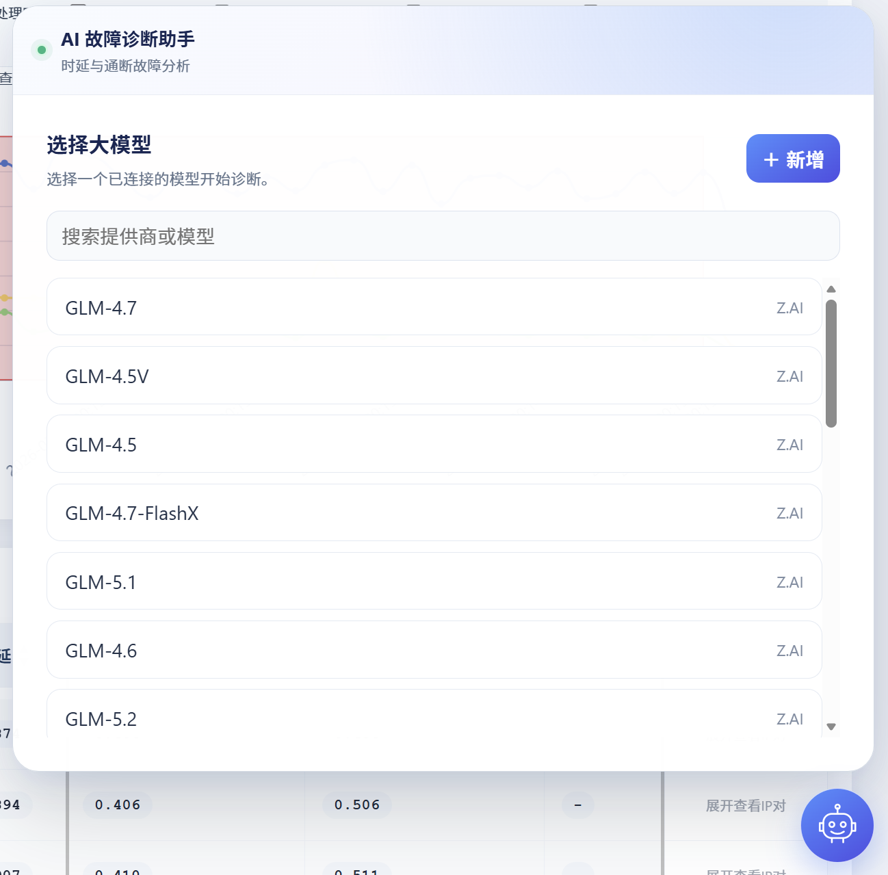

- 选择当前已连接的大模型，进入会话
- 或点击"新增"按钮，连接到新的大模型提供商和模型
- 支持搜索提供商或模型名

#### 8.3 新增提供商页

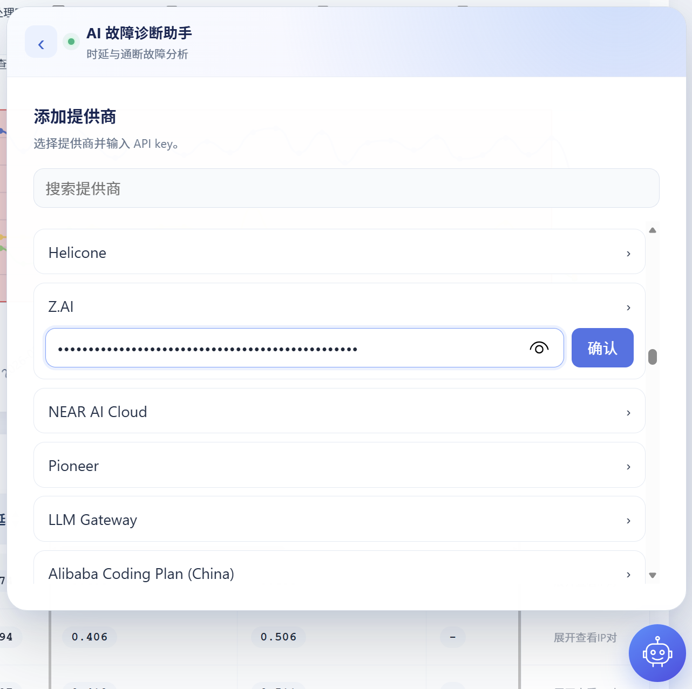

- 点击某一个大模型提供商，输入用户自己的 API key，点击确认，进入新增模型页
- 支持搜索提供商名称

#### 8.4 新增模型页

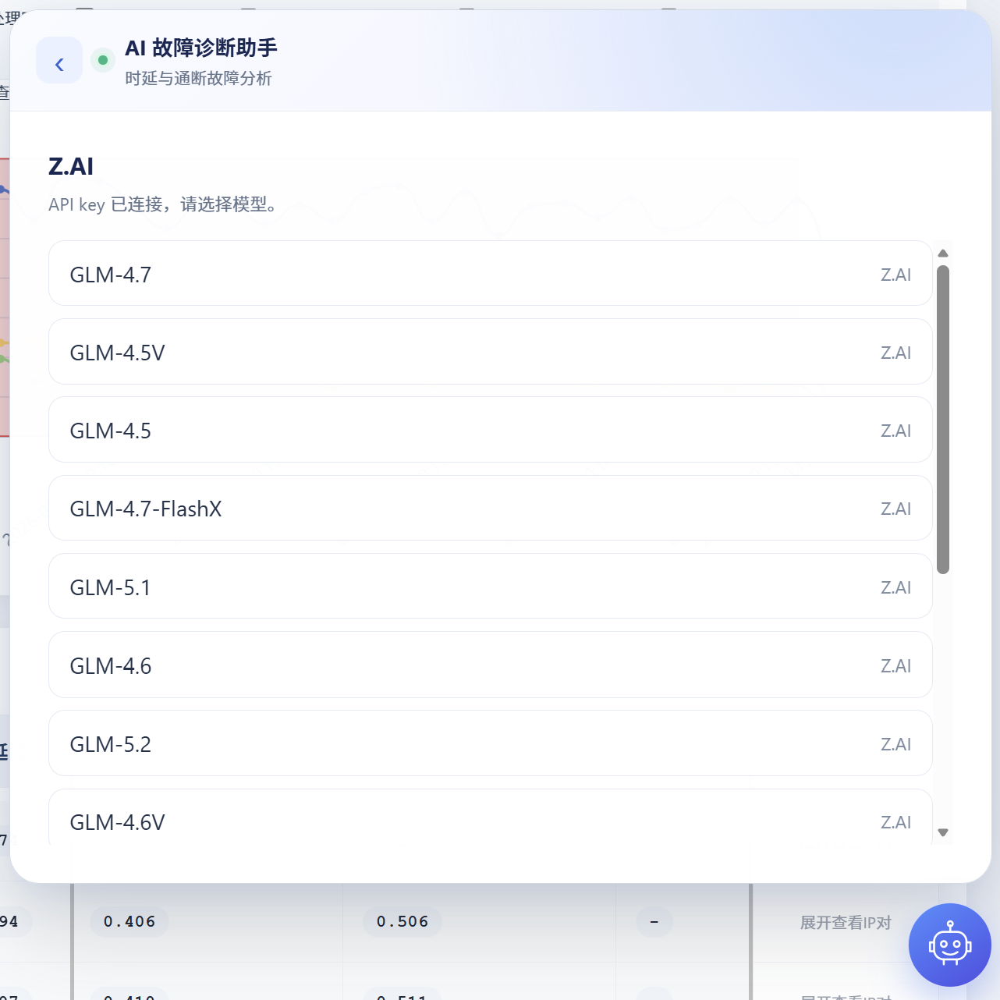

- 选择当前提供商的 API key 支持的模型，进入会话

#### 8.5 Agent 智能体对话页

可输入想要咨询的问题，Agent 智能体会根据当前监控页的内容和历史数据，结合知识库和诊断规则，给出智能化的分析和建议，帮助用户快速定位问题和解决方案。

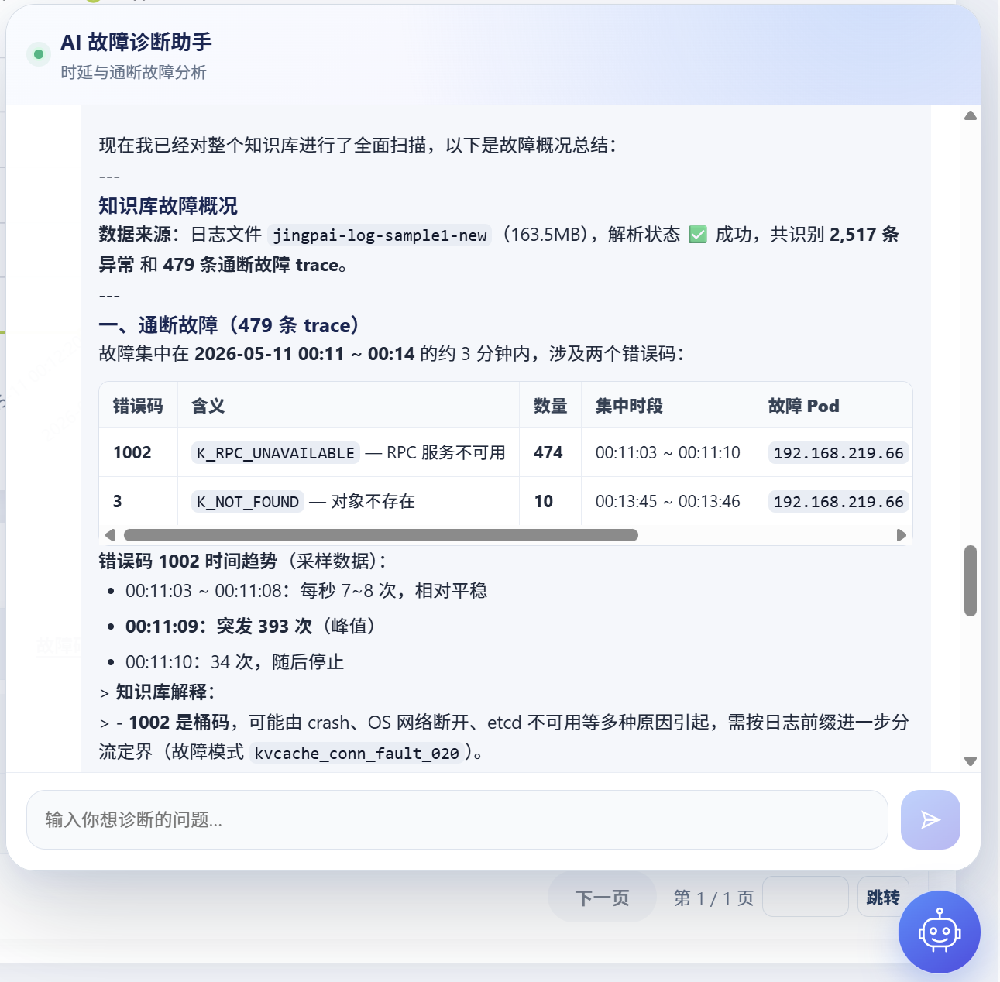

---

## 相关文档

- 数据采集工具使用指南 → [02-data-collection-guide.md](02-data-collection-guide.md)
- 配置参考手册 → [03-configuration-reference.md](03-configuration-reference.md)
- 部署指南 → [../deployment/01-overview.md](../deployment/01-overview.md)
